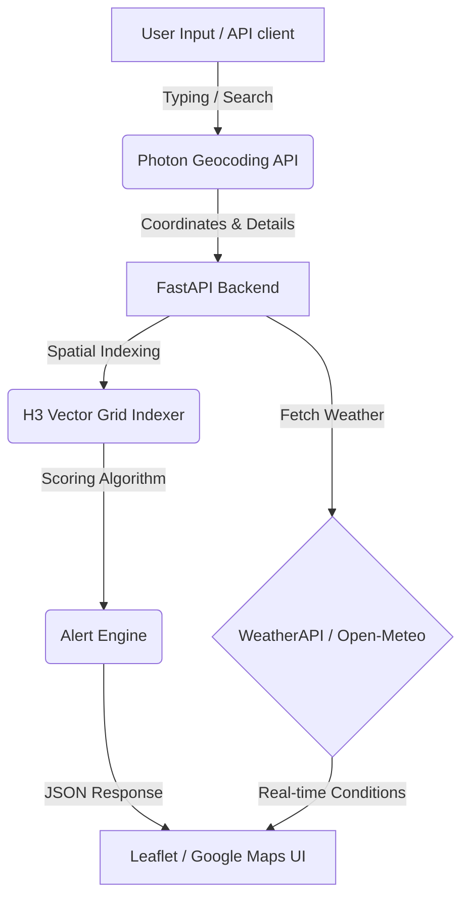

# AI Weather Map 🌍⛈️

An async-first Python web application for real-time worldwide weather ingestion, geo-spatial indexing (using H3 grids), path-based route risk scoring, and interactive map visualisations.

---

## 💡 Why Use This?
Traditional weather apps are either too heavy, limited by expensive geolocation APIs, or fail to resolve small villages and suburbs. 

**AI Weather Map** solves this by:
* **High Accessibility**: Uses a free, highly reliable, and keyless global geocoding suggestion engine (Photon/OpenStreetMap) that searches any town, village, or city in the world.
* **Smart Route Planning**: Automatically indexes coordinates into geo-spatial cells (using H3 hexagonal grids) to calculate safety risk scores along routes—critical for logistics, shipping, and travel.
* **API Resiliency**: Integrates dynamic fallbacks between premium weather APIs (WeatherAPI) and open forecasting APIs (Open-Meteo).

---

## 🎯 Use Cases
* **Logistics & Route Dispatching**: Score shipping routes for weather severity before vehicles start transit.
* **Everyday Travel Planning**: Search smaller municipalities (like *Yelahanka* or *Avalahalli*) to get instant weather summaries.
* **Emergency Management**: Stream real-time simulated radar detections onto maps using server-sent event (SSE) streams.

---

## 🛠️ Key Features
* **Worldwide Autocomplete Search**: Debounced dropdown search suggestions that list matching places globally with type tags (e.g., suburb, village, airfield).
* **Responsive Interactive Map**: Auto-detects Google Maps configuration, falling back to a glassmorphic Leaflet.js (OpenStreetMap) layout with smooth viewport sizing.
* **Risk Scoring Engine**: Analyzes weather severity (precipitation, wind speed, lightning storms) to grade travel routes (`info` ➡️ `warning` ➡️ `critical`).
* **Interactive AI Assistant**: Features an embedded chatbot console designed to query current weather and assess route safety.

---

## ⚙️ How It Works



1. **Geocoding & Autocomplete**: The UI captures keystrokes and queries the Photon geocoding proxy to populate candidates.
2. **Weather Retrieval**: The backend maps coordinates to current weather signals via WeatherAPI or Open-Meteo.
3. **Geo-indexing**: Coordinates are mapped to unique H3 indices. The **Alert Engine** then aggregates safety profiles.
4. **Reactive Rendering**: Map viewports update dynamically and place marker pins corresponding to the chosen candidate.

---

## 🚀 Getting Started

### 1. Configure Environment
Create a `.env` file in the root directory (refer to `.env.example`):
```env
AI_WEATHER_WEATHER_API_KEY=your_weatherapi_key
AI_WEATHER_GROQ_API_KEY=your_groq_key
AI_WEATHER_GOOGLE_MAPS_API_KEY=your_google_maps_key
```

### 2. Run Locally
Install dependencies, then start the FastAPI application with Uvicorn:
```bash
pip install -r requirements.txt
uvicorn app.main:app --reload
```
Open **[http://127.0.0.1:8000/](http://127.0.0.1:8000/)** in your web browser.

---

## 🔌 API Endpoints
* `GET /v1/weather/search?query=<name>`: Autocomplete suggestions.
* `POST /v1/weather/location`: Full geocoding and weather analysis.
* `POST /v1/routing/score`: Computes route risk score for a set of coordinates.
* `GET /v1/weather/stream`: Real-time streaming radar frame detections.
